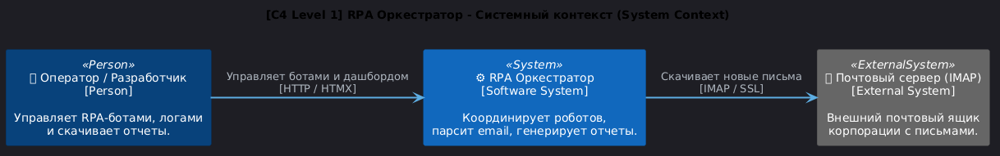
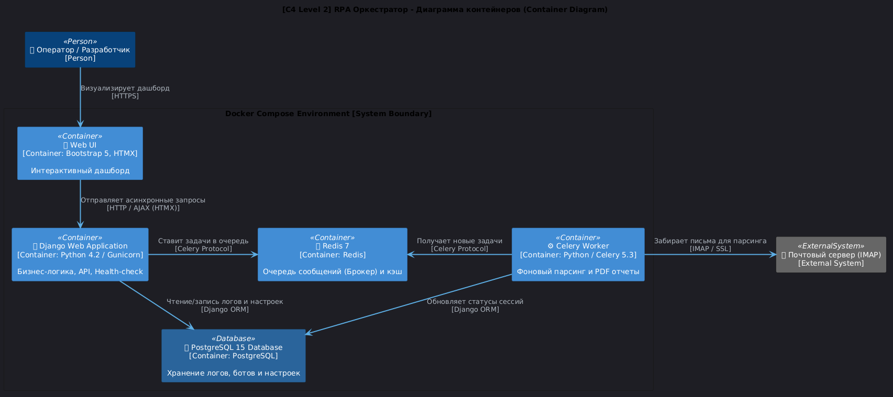
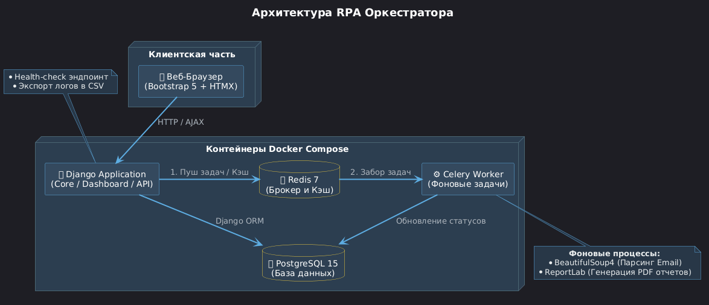
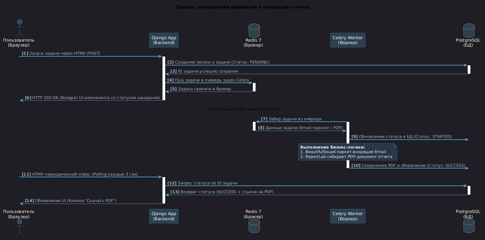
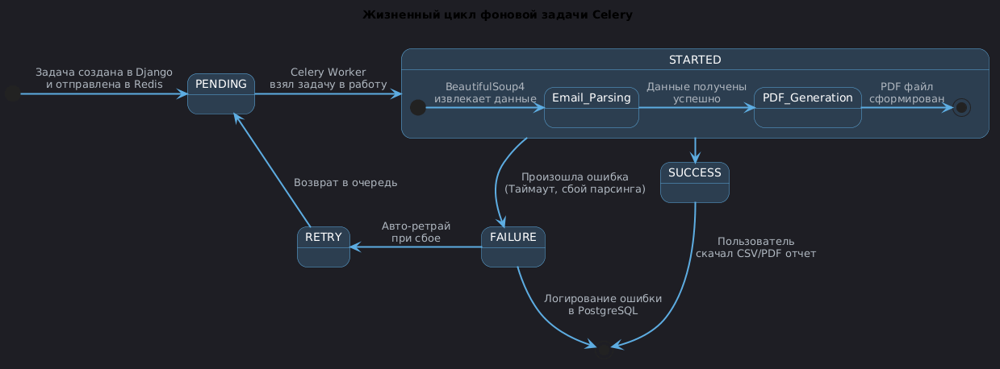

# RPA Оркестратор


**RPA Оркестратор** — это веб-платформа для централизованного управления, мониторинга и координации программных роботов (RPA). Проект предназначен для автоматизации рутинных процессов, распределения задач между воркерами, отслеживания статусов выполнения в реальном времени и анализа эффективности цифровых сотрудников.

## 🚀 Возможности

- [x] **Управление ботами**: Централизованный запуск, остановка и конфигурация RPA-скриптов.
- [x] **Асинхронная обработка**: Распределение тяжелых задач с помощью Celery и Redis.
- [x] **Парсинг Email**: Автоматический сбор и обработка входящих писем с использованием BeautifulSoup4.
- [x] **Генерация отчетов**: Автоматическое создание PDF-документов по результатам работы ботов через ReportLab.
- [x] **Интерактивный дашборд**: Мониторинг ключевых метрик, фильтрация логов и экспорт данных в CSV.
- [x] **Динамический UI**: Обновление интерфейса без перезагрузки страниц с помощью HTMX и Bootstrap 5.
- [x] **Мониторинг системы**: Выделенный Health-check эндпоинт для контроля доступности сервисов.
- [x] **Готовность к продакшену**: Контейнеризация всех компонентов и автоматический CI/CD пайплайн.

## 🛠 Стек технологий

<table>
  <thead>
    <tr>
      <th align="left">Компонент</th>
      <th align="left">Технология</th>
      <th align="left">Назначение</th>
    </tr>
  </thead>
  <tbody>
    <tr>
      <td><b>Backend</b></td>
      <td>Python 3.11 / Django 4.2</td>
      <td>Основная бизнес-логика, ORM, авторизация и API управления.</td>
    </tr>
    <tr>
      <td><b>Database</b></td>
      <td>PostgreSQL 15</td>
      <td>Хранение данных о ботах, пользователях, задачах и логах.</td>
    </tr>
    <tr>
      <td><b>Task Broker</b></td>
      <td>Redis 7</td>
      <td>Брокер сообщений для Celery и кеширование данных.</td>
    </tr>
    <tr>
      <td><b>Task Queue</b></td>
      <td>Celery 5.3</td>
      <td>Очередь задач, фоновое выполнение воркеров и периодические таски.</td>
    </tr>
    <tr>
      <td><b>Frontend</b></td>
      <td>Bootstrap 5 / HTMX</td>
      <td>Адаптивная верстка и интерактивные AJAX-запросы без JS-фреймворков.</td>
    </tr>
    <tr>
      <td><b>Parsing</b></td>
      <td>BeautifulSoup4</td>
      <td>Извлечение полезной информации и вложений из писем.</td>
    </tr>
    <tr>
      <td><b>Reporting</b></td>
      <td>ReportLab</td>
      <td>Динамическая генерация PDF-отчетов по выполненным сессиям.</td>
    </tr>
    <tr>
      <td><b>DevOps</b></td>
      <td>Docker / Docker Compose</td>
      <td>Изоляция окружения, контейнеризация сервисов и оркестрация.</td>
    </tr>
    <tr>
      <td><b>CI/CD</b></td>
      <td>GitHub Actions</td>
      <td>Автоматическое тестирование, проверка линтерами при Push/PR.</td>
    </tr>
  </tbody>
</table>

## 📐 Архитектура и рабочие процессы (C4 Model)

Проектирование архитектуры RPA Оркестратора выполнено по методологии **C4 Model**, что обеспечивает наглядность системы от бизнес-контекста до уровня изолированных Docker-контейнеров и жизненного цикла задач.

<details>
<summary><b>🗺 Уровень 1: Системный контекст (System Context) — Нажмите, чтобы открыть</b></summary>
<br>

Диаграмма верхнего уровня показывает, как пользователи взаимодействуют с платформой и какие внешние сервисы задействованы в автоматизации:


</details>

<details>
<summary><b>📦 Уровень 2: Диаграмма контейнеров (Container Diagram) — Нажмите, чтобы открыть</b></summary>
<br>

Детальная схема внутренней инфраструктуры, развернутой внутри Docker Compose, распределение ролей между компонентами и протоколы обмена данными:


</details>

<details>
<summary><b>🔄 Диаграмма последовательности и состояний задач — Нажмите, чтобы открыть</b></summary>
<br>

**1. Инфраструктурные компоненты (Компонентная схема):**
Общая схема взаимодействия контейнеров в Docker Compose окружении.



**2. Обработка асинхронных задач (Sequence Diagram):**
Пошаговый процесс от момента клика пользователя до асинхронного парсинга через `beautifulsoup4`, генерации отчета через `reportlab` и отдачи результата в UI с помощью `HTMX-polling`.



**3. Жизненный цикл Celery-задачи (State Diagram):**
Карта переходов состояний Celery-воркера (`PENDING ➔ STARTED ➔ SUCCESS/FAILURE`).


</details>

<details>
<summary><b>🛠 Инструкция для разработчика по обновлению схем</b></summary>
<br>

Исходный код всех диаграмм хранится в формате PlantUML в папке `docs/`. Если вы внесли изменения в файлы `.puml`, пересоберите всю графику одной командой:
```bash
make puml
```
</details>

## 📂 Структура проекта

```text
rpa-orchestrator/
├── .github/
│   └── workflows/
│       └── ci.yml              # Конфигурация GitHub Actions CI/CD
├── config/                     # Настройки Django проекта
│   ├── __init__.py
│   ├── asgi.py
│   ├── celery.py               # Инициализация Celery
│   ├── settings.py             # Основные настройки
│   ├── urls.py                 # Главный маршрутизатор URL
│   └── wsgi.py
├── apps/                       # Приложения проекта
│   ├── core/                   # Базовые вьюхи, миксины, health-check
│   ├── orchestrator/           # Модели ботов, логика управления, CSV экспорт
│   └── tasks/                  # Celery задачи, логика ReportLab и BeautifulSoup4
├── docs/                       # Схемы архитектуры (PUML) и сгенерированные PNG файлы
│   ├── architecture.puml
│   ├── architecture.png
│   ├── c4_container.puml
│   ├── c4_container.png
│   ├── c4_context.puml
│   ├── c4_context.png
│   ├── sequence.puml
│   ├── sequence.png
│   ├── states.puml
│   └── states.png
├── static/                     # Статические файлы (CSS, JS, Images)
├── templates/                  # HTML шаблоны (Bootstrap 5 + HTMX)
├── docker/                     # Специфичные настройки для Docker-окружения
│   └── django/
│       └── Dockerfile          # Сборка образа для Django и Celery
├── .env.example                # Шаблон файла конфигурации окружения
├── docker-compose.yml          # Оркестрация контейнеров
├── Makefile                    # Ярлыки для часто используемых команд
├── manage.py                   # CLI утилита Django
└── requirements.txt            # Зависимости Python проекта
```

## ⚡ Быстрый старт

### Требования
- Установленный **Docker** и **Docker Compose**
- Утилита **make** (опционально, для удобства запуска команд)

### Шаг 1: Клонирование репозитория
```bash
git clone https://github.com
cd rpa-orchestrator
```

### Шаг 2: Настройка переменных окружения
Скопируйте шаблон конфигурации и при необходимости отредактируйте переменные:
```bash
cp .env.example .env
```

### Шаг 3: Запуск платформы
Запустите проект в Docker-контейнерах одной командой:
```bash
make up
```
*Если утилита `make` отсутствует, выполните стандартную команду:*
```bash
docker compose up -d --build
```
Эта команда автоматически соберет Docker-образы, применит миграции базы данных, создаст статические файлы и запустит веб-сервер, базу данных, Redis и Celery-воркер.

## 🔗 Адреса доступа

После успешного запуска сервисы доступны по следующим локальным адресам:

<table>
  <thead>
    <tr>
      <th align="left">Сервис</th>
      <th align="left">URL</th>
      <th align="left">Назначение</th>
    </tr>
  </thead>
  <tbody>
    <tr>
      <td><b>Web UI</b></td>
      <td><a href="http://127.0.0">http://127.0.0.0</a></td>
      <td>Главный дашборд оркестратора, фильтрация и управление роботами.</td>
    </tr>
    <tr>
      <td><b>Django Admin</b></td>
      <td><a href="http://127.0.0.0/admin/">http://127.0.0admin/</a></td>
      <td>Административная панель для глубокого изменения моделей и логов.</td>
    </tr>
    <tr>
      <td><b>Health Check</b></td>
      <td><a href="http://127.0.0.0/health/">http://127.0.0health/</a></td>
      <td>Эндпоинт автоматического мониторинга статуса и доступности системы.</td>
    </tr>
  </tbody>
</table>

## 🧪 Тестирование и мониторинг

### Запуск тестов
Для проверки работоспособности выполните запуск тестового набора внутри контейнера:
```bash
make test
```
*Или напрямую через Docker Compose:*
```bash
docker compose exec web python manage.py test
```

### Проверка Health-check
Для мониторинга доступности можно отправить HTTP-запрос к эндпоинту:
```bash
curl -i http://127.0.0health/
```

В случае корректной работы системы эндпоинт вернет HTTP-статус `200 OK` и JSON-ответ со статусами связанных компонентов.

## 🛠 Команды управления (Makefile)

Проект снабжен `Makefile` для быстрой работы с основными командами.

```bash
make up             # Собрать образы и запустить контейнеры в фоне
make down           # Остановить и удалить все контейнеры проекта
make restart        # Перезапустить все сервисы оркестратора
make logs           # Просмотреть логи всех контейнеров в реальном времени
make migrate        # Применить миграции базы данных PostgreSQL
make superuser      # Создать администратора для доступа в /admin
make test           # Запустить тесты Django внутри Docker-контейнера
make shell          # Войти в интерактивную оболочку Django Shell
make puml           # Перегенерировать все схемы из .puml в .png через Docker
```

## 📬 Контакты и поддержка

Если у вас появились вопросы, предложения или вы нашли ошибку, создайте новый Issue в данном репозитории.

- **Автор проекта**: IGMA-IGMA
- **Email**: i9296517650@yandex.ru

---

⭐️ **Понравился проект?** Поставьте ему звезду на GitHub, чтобы поддержать автора и развитие RPA Оркестратора!
